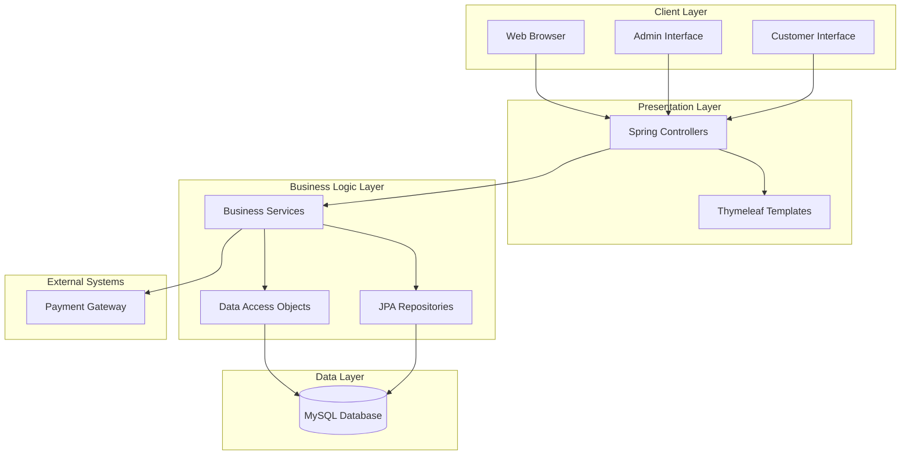
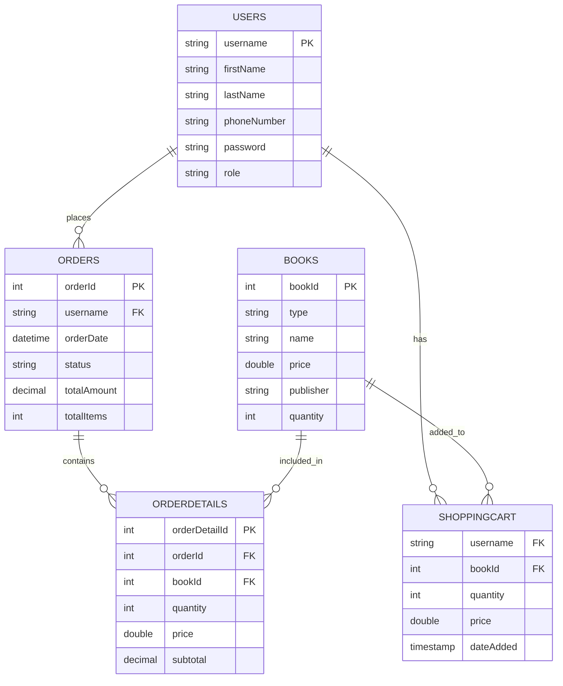
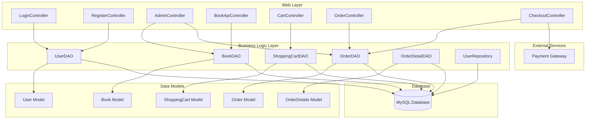
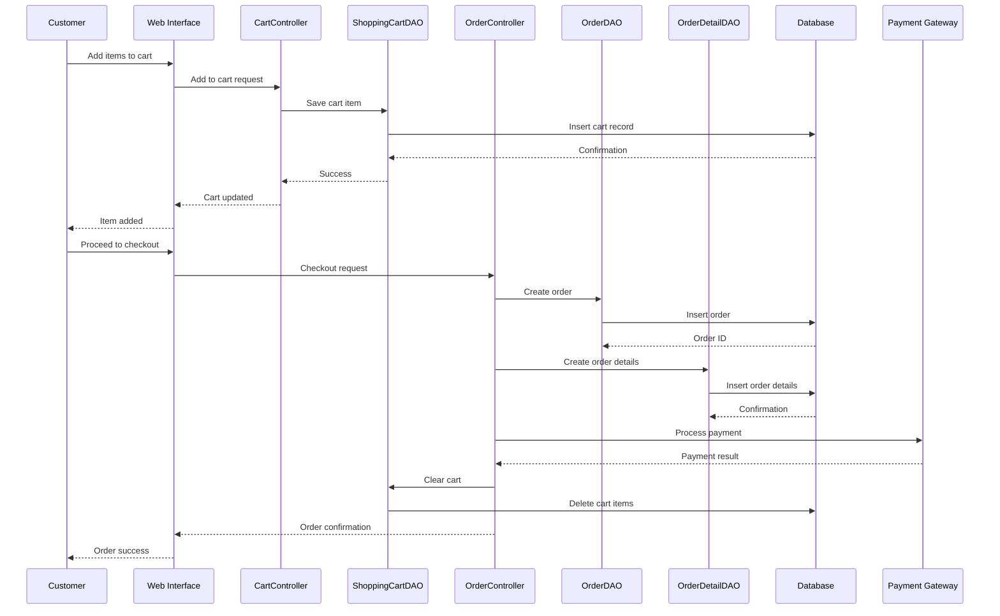
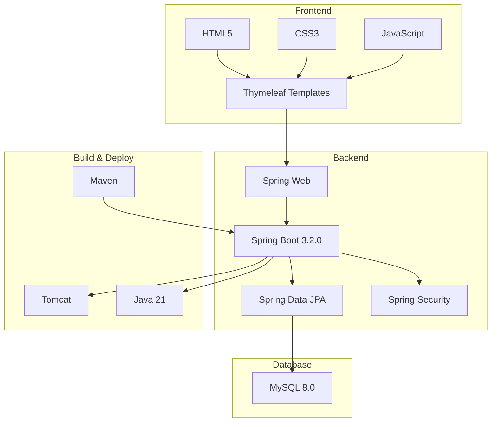

# Bookstore Management System - Conceptual Diagram

## System Architecture Overview

## Entity Relationship Diagram

## Use Case Diagram

```mermaid
graph TB
    subgraph "Actors"
        Admin[Admin User]
        Customer[Customer User]
        Guest[Guest User]
    end
    
    subgraph "Authentication & User Management"
        UC1[Login]
        UC2[Register]
        UC3[Logout]
        UC4[Manage Users]
    end
    
    subgraph "Book Management"
        UC5[View Books]
        UC6[Search Books]
        UC7[Add Book]
        UC8[Edit Book]
        UC9[Delete Book]
        UC10[Update Inventory]
    end
    
    subgraph "Shopping Cart"
        UC11[Add to Cart]
        UC12[Remove from Cart]
        UC13[Update Quantity]
        UC14[View Cart]
    end
    
    subgraph "Order Management"
        UC15[Place Order]
        UC16[View Orders]
        UC17[Order Details]
        UC18[Process Orders]
        UC19[Update Order Status]
    end
    
    subgraph "Checkout Process"
        UC20[Checkout]
        UC21[Payment Processing]
        UC22[Order Confirmation]
    end
    
    Admin --> UC1
    Admin --> UC3
    Admin --> UC4
    Admin --> UC7
    Admin --> UC8
    Admin --> UC9
    Admin --> UC10
    Admin --> UC18
    Admin --> UC19
    
    Customer --> UC1
    Customer --> UC2
    Customer --> UC3
    Customer --> UC5
    Customer --> UC6
    Customer --> UC11
    Customer --> UC12
    Customer --> UC13
    Customer --> UC14
    Customer --> UC15
    Customer --> UC16
    Customer --> UC17
    Customer --> UC20
    Customer --> UC21
    Customer --> UC22
    
    Guest --> UC5
    Guest --> UC6
    Guest --> UC2
```

## Component Diagram

## Sequence Diagram - Order Processing

## Technology Stack

## Key Features

### For Customers:
- User registration and authentication
- Browse and search books by category
- Add books to shopping cart
- Manage shopping cart (update quantities, remove items)
- Place orders with checkout process
- View order history and details
- Real-time inventory checking

### For Administrators:
- Manage book inventory (add, edit, delete books)
- Update book quantities and prices
- View and process customer orders
- Manage user accounts
- Monitor system status
- Generate reports

### System Capabilities:
- Secure user authentication and authorization
- Shopping cart persistence
- Order management with status tracking
- Inventory management
- Payment processing integration
- Responsive web interface
- Database transaction management 